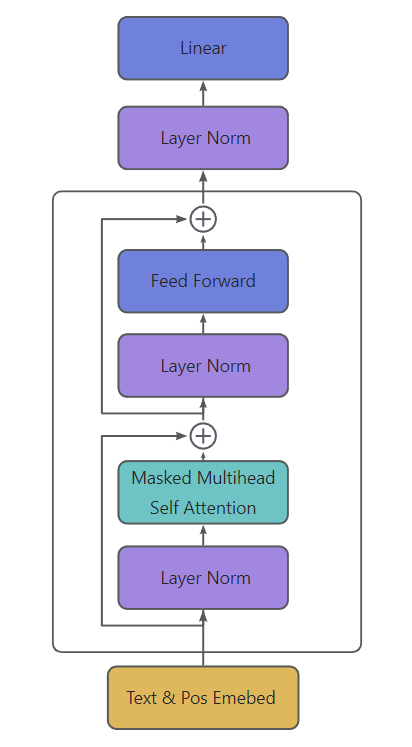
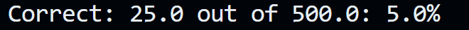
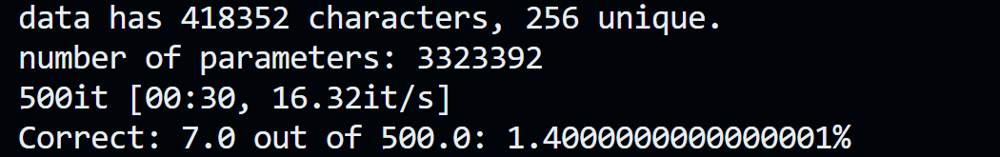
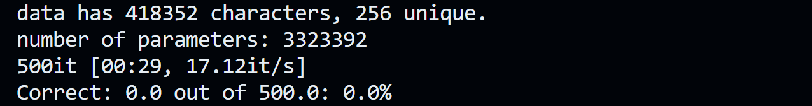
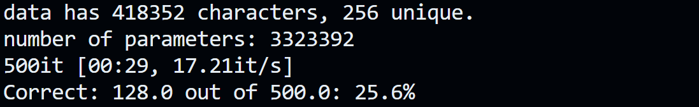
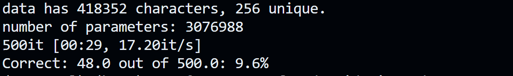
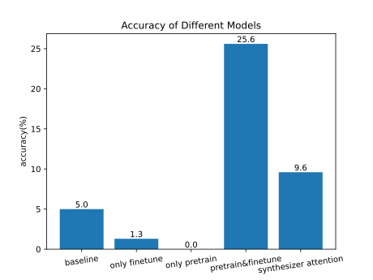

## GPT2 Pretrain & Finetune

### 1. Model




### 2. Pretrain

This GPT2 model is pretrained on `Wiki.txt` . 

First I constructed `CharCorruptionDataset` where I add change the internal order of chars for each document in the `wiki.txt`. Here are some examples of input-output pairs (x, y):

```txt
  x: Khatchig Mouradian. Khatchig Mouradian is a jour⁇and tran⁇nalist, writer ⁇□□□□□□□□□□□□□□□□□□□□□□□□□□□□□□□□□□□□□□□□□□□□□□□□□□□□□
  y: hatchig Mouradian. Khatchig Mouradian is a jour⁇and tran⁇nalist, writer ⁇□□□□□□□□□□□□□□□□□□□□□□□□□□□□□□□□□□□□□□□□□□□□□□□□□□□□□□

  x: Jaco⁇enry ⁇b H⁇□□□□□□□□□□□□□□□□□□□□□□□□□□□□□□□□□□□□□□□□□□□□□□□□□□□□□□□□□□□□□□□□□□□□□□□□□□□□□□□□□□□□□□□□□□□□□□□□□□□□□□□□□□□□□□□□
  y: aco⁇enry ⁇b H⁇□□□□□□□□□□□□□□□□□□□□□□□□□□□□□□□□□□□□□□□□□□□□□□□□□□□□□□□□□□□□□□□□□□□□□□□□□□□□□□□□□□□□□□□□□□□□□□□□□□□□□□□□□□□□□□□□□

  x: John Stephen. Born in Glasgow, Steph⁇lder's apprentice on⁇en became a we⁇□□□□□□□□□□□□□□□□□□□□□□□□□□□□□□□□□□□□□□□□□□□□□□□□□□□□□□
  y: ohn Stephen. Born in Glasgow, Steph⁇lder's apprentice on⁇en became a we⁇□□□□□□□□□□□□□□□□□□□□□□□□□□□□□□□□□□□□□□□□□□□□□□□□□□□□□□□
```


### 3. Finetune

This GPT2 model is finetuned on `brith_places_train.tsv`, evaluated on `birth_dev.tsv`, tested on `birth_test_inputs.tsv`. 

I constructed `NameDataset`, which is defined in `src/dataset.py`. The input-output pairs (x, y) of the `NameDataset` are of the following form:

```txt
  x: Where was Khatchig Mouradian born?⁇Lebanon⁇□□□□□□□□□□□□□□□□□□□□□□□□□□□□□□□□□□□□□□□□□□□□□□□□□□□□□□□□□□□□□□□□□□□□□□□□□□□□□□□□□□□□
  y: □□□□□□□□□□□□□□□□□□□□□□□□□□□□□□□□□⁇Lebanon⁇□□□□□□□□□□□□□□□□□□□□□□□□□□□□□□□□□□□□□□□□□□□□□□□□□□□□□□□□□□□□□□□□□□□□□□□□□□□□□□□□□□□□□
  
  x: Where was Jacob Henry Studer born?⁇Columbus⁇□□□□□□□□□□□□□□□□□□□□□□□□□□□□□□□□□□□□□□□□□□□□□□□□□□□□□□□□□□□□□□□□□□□□□□□□□□□□□□□□□□□
  y: □□□□□□□□□□□□□□□□□□□□□□□□□□□□□□□□□⁇Columbus⁇□□□□□□□□□□□□□□□□□□□□□□□□□□□□□□□□□□□□□□□□□□□□□□□□□□□□□□□□□□□□□□□□□□□□□□□□□□□□□□□□□□□□
```

Using the PAD_CHAR characters in y before the ⁇[place] keeps the trainer from optimizing the model to predict the question, "Where was...".


## 4. Results

### Baseline

I made a baseline model which predict all answers of questions are London.

The result: 

```
python src/london_baseline.py
```



### GPT2 Model with CausalSelfAttention

#### Finetuned without Pretrained:

```sh
sh scripts/vanilla/finetune.sh # create vanilla.model.params
sh scripts/vanilla/evaluate.sh 
```



#### Pretrained without Finetuned(zero-shot Learning)

```sh
sh scripts/pretrain_finetune/pretrain.sh # if you have pretrained (created vanilla.pretrain.params), this script could be omitted
sh scripts/pretrain_finetune/evaluate_no_finetune.sh
```



#### Pretrained followed by Finetuned

```sh
sh scripts/pretrain_finetune/pretrain.sh # if you have pretrained (created vanilla.pretrain.params), this script could be omitted
sh scripts/pretrain_finetune/finetune.sh # if you have finetuned (created vanilla.finetune.params), this script could be omitted
sh scripts/pretrain_finetune/evaluate.sh
```




### GPT2 Model with SynthesizerAttention

```sh
sh scripts/synthesizer/pretrain.sh # create synthesizer.pretrain.params
sh scripts/synthesizer/finetune.sh # create synthesizer.finetune.params
sh scripts/synthesizer/evaluate.sh
```




-- --



